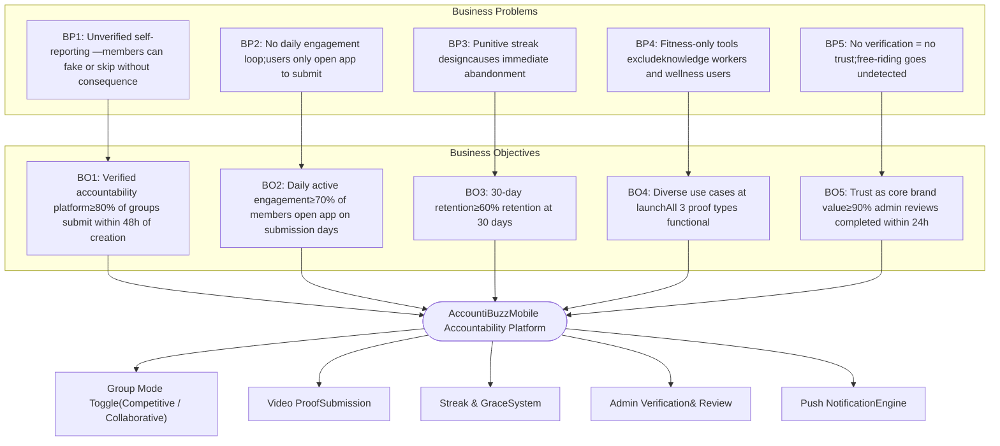
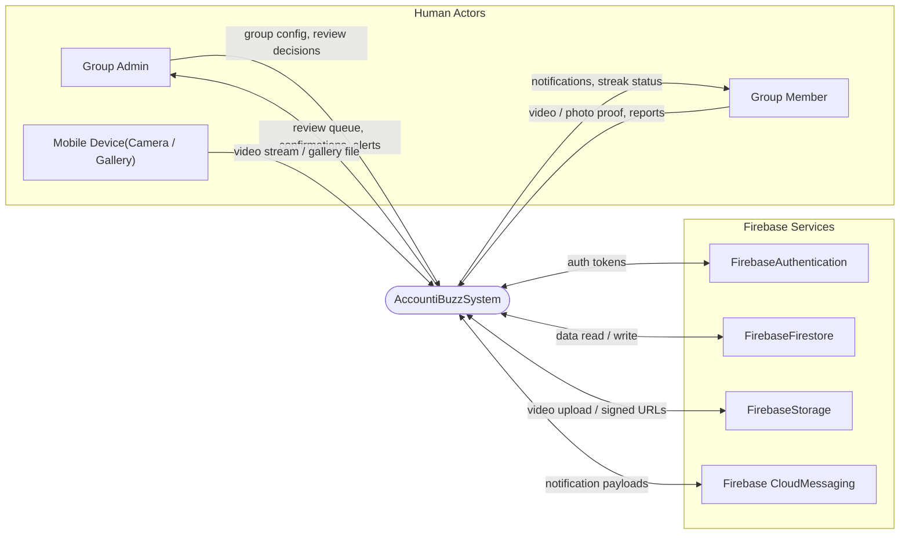
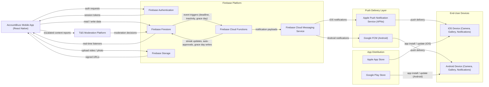
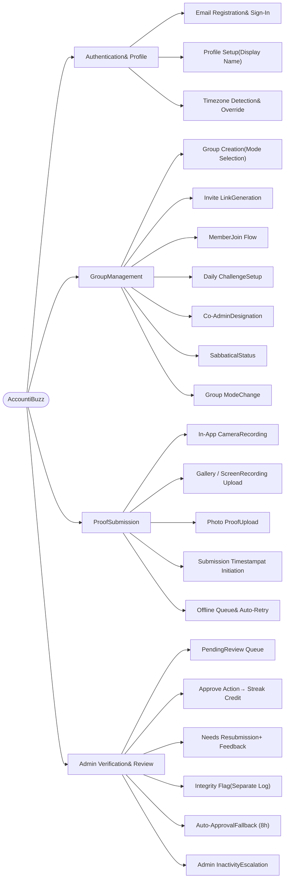
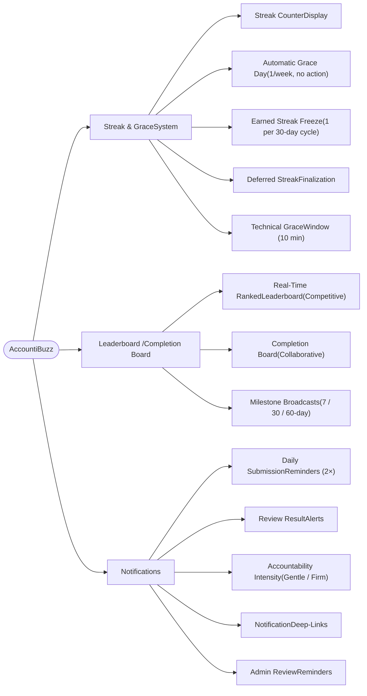

# AccountiBuzz - Requirements Engineering - 1

---

## 1. Business Objective Model

---

## 2. Context Diagram
**Key:** Rectangles = External Entities | Oval = System | Arrows = Data Flows

---

## 3. Ecosystem Map

---

## 4. Feature Tree
### Part A — Core Features

### Part B — Engagement & Trust Features

---

## 5. External Events
- Member submits a video, screen recording, or photo proof.
- Member initiates a resubmission after receiving feedback.
- Member joins a group via invite link.
- Admin creates a new group and sets the group mode.
- Admin approves a pending submission.
- Admin requests resubmission with a feedback message.
- Admin flags a submission for a violation.
- Admin promotes a member to co-admin.
- Admin sends a broadcast message to the group.
---
